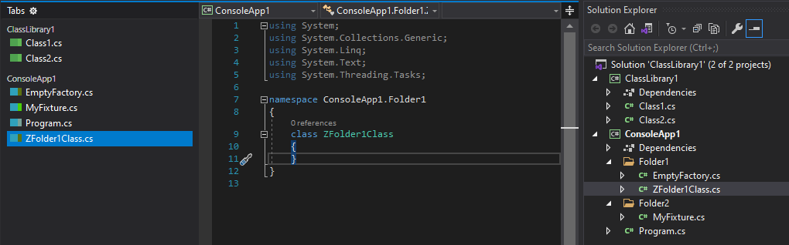

# ColorTabs2019

Color Tabs Extension for Visual Studio 2019.

This Vsix will add a colored rectangle left of your tab name. Color is based on your project file path. No way to determine specific color for specific project exsist yet.

Colored rectangles will be visible only if you are using a left/right layout for the tab panel. Top layout does not support yet.

I DO NOT test it against:

- any Visual Studio theme except dark
- any project types except `csproj`

Please keep in mind: I have no plans to invest a lot of time here. So PR are welcome :)
